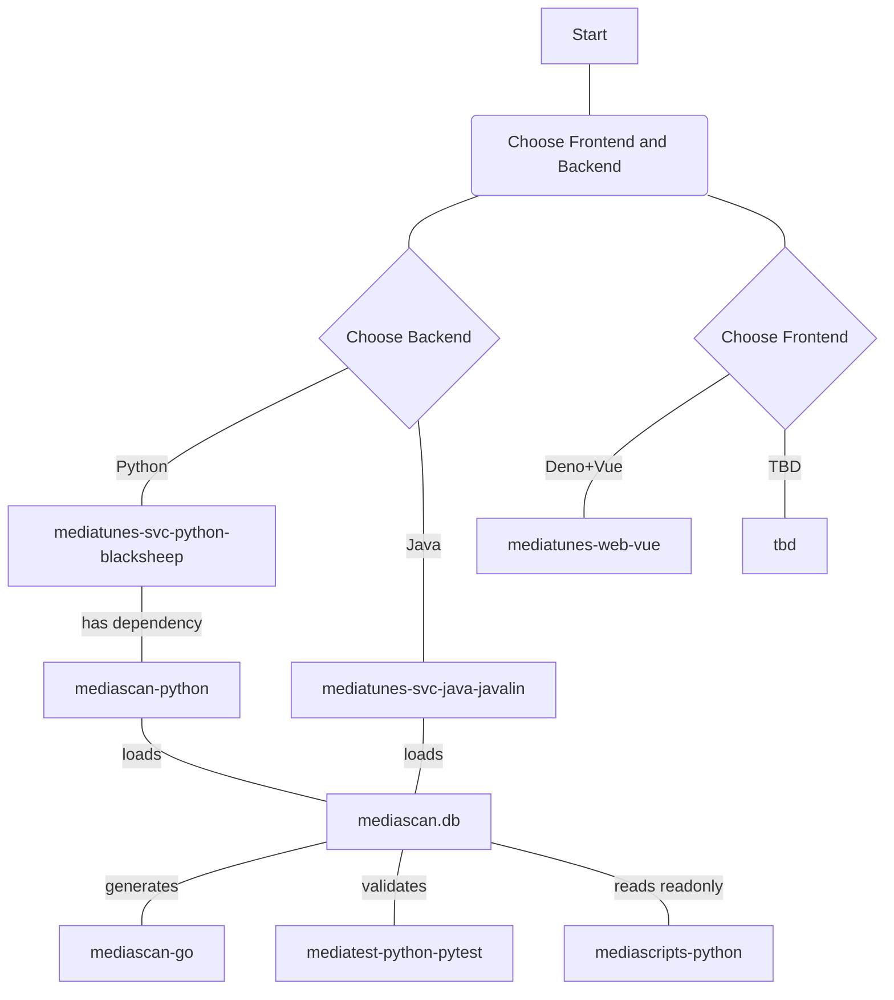

## Moongas mediatunes API Service (Python+BlackSheep implementation)

> 🚧 **Status: Work in Progress (WIP)**  
> This project is currently under active development. Features, APIs, and documentation are subject to change.

---

## Overview

**Python+BlackSheep API service for Moongas hybrid media collections—backend for the Moongas `mediatunes` web application**

### A component of the `moongas` ecosystem of media library tools

- [moongas-collection-demo](https://github.com/moongas-org/moongas-collection-demo) [](https://github.com/moongas-org/moongas-collection-demo/actions/workflows/ci.yml) - Example Moongas media collection (metadata only)
- [moongas-mediatunes-web-vue](https://github.com/moongas-org/moongas-mediatunes-web-vue) [](https://github.com/moongas-org/moongas-mediatunes-web-vue/actions/workflows/ci.yml) - A Deno-tooled TypeScript/Vue SPA for Moongas hybrid media collections, pairing with the separate moongas-mediatunes-svc-python-blacksheep backend to seemlessly blend offline and streaming playback
- [moongas-mediatunes-svc-python-blacksheep](https://github.com/moongas-org/moongas-mediatunes-svc-python-blacksheep) [](https://github.com/moongas-org/moongas-mediatunes-svc-python-blacksheep/actions/workflows/ci.yml) - Python+BlackSheep implementation of API service for Moongas hybrid media collections—backend for Moongas mediatunes web application (moongas-mediatunes-web-vue)
- [moongas-mediatunes-svc-java-javalin](https://github.com/moongas-org/moongas-mediatunes-svc-java-javalin) [](https://github.com/moongas-org/moongas-mediatunes-svc-java-javalin/actions/workflows/ci.yml) - Java+Javalin implementation of API service for Moongas hybrid media collections—backend for Moongas mediatunes web application (moongas-mediatunes-web-vue)
- [moongas-mediascan-go](https://github.com/moongas-org/moongas-mediascan-go) [](https://github.com/moongas-org/moongas-mediascan-go/actions/workflows/ci.yml) - Golang module to scan media collections and Moongas Yaml metatadata, outputs Moongas database
- [moongas-mediascan-python](https://github.com/moongas-org/moongas-mediascan-python) [](https://github.com/moongas-org/moongas-mediascan-python/actions/workflows/ci.yml) - Python library with data classes for loading Moongas mediascan databases and Yaml metadata files
- [moongas-mediascripts-python](https://github.com/moongas-org/moongas-mediascripts-python) [](https://github.com/moongas-org/moongas-mediascripts-python/actions/workflows/ci.yml) - Python scripts for working with Moongas media collections.
- [moongas-mediatest-python-pytest](https://github.com/moongas-org/moongas-mediatest-python-pytest) [](https://github.com/moongas-org/moongas-mediatest-python-pytest/actions/workflows/ci.yml) - Python tool for enforcing media collection rules (implemented with `pytest`)



## Running

```sh
python run.py mediatunes-config.yml
```

## (API) Live Demos
- [Live Demo (hosted on moongas-org.com)](https://moongas-org.com/mediatunes/api)
- [Live Demo (hosted on moongas.org)](https://moongas.org/mediatunes/api)

### (API) albums - filtered by year range

[moongas-org.com/mediatunes/api/albums?minYear=1990&maxYear=2004](https://moongas-org.com/mediatunes/api/albums?minYear=1990&maxYear=2004)

## Screenshots

[Screenshots](./doc/screenshots/README.md)

## Web frontend

The web UI single-page application (Vue 3 + TypeScript, built with Vite) has moved to a separate repo. It consumes this backend's JSON API (`app/api/` — `/api/config`, `/api/albums`, `/api/tracks`, `/api/artists`, `/api/artist`, `/api/genres`, `/api/artist-geo/<kind>`, `/api/wordcloud/*`, `/api/random-track`) and the media files via `/getfile/*`.

## Features

- Simple minimalist web interface
- Perfect for a party jukebox hosted on your home WiFi network
- Multiple playback options (configurable):
    1. Play local media files in the browser (using HTML5 `<audio>` tag)
    2. "Play" by opening YouTube search for _"(artist) (album) (title) video"_ (configurable)
        - Great for finding music videos of your favorite music
        - Great for creating YouTube playlists of music videos meeting certain filter criteria (e.g. 80s New Wave music videos for your 80s party)
        - IMHO mediatunes + YouTube premium (no ads) is better than YouTube Music or Spotify
    3. (Default) Display both options
- Album art displayed at a beautiful `1000x1000px` resolution
    - (bandwidth optimized by converting to `.webp` at 80% quality if hosted by yours truly)
- Continuous shuffle playback with filtering options
- Fast (tested with a library of 20,000+ music files)
- Versatile filtering and sorting via a common set of intuitive url parameters
- Comprehensive browsing options—browse by _artist_, _album_, _genre_, _year_, _year range_, and more
- _Name That Tune_—plays a song without displaying the info, but offering hints, challenging the user to name the artist/tune
- Direct download of music files via hyperlinks
- Accessible from mobile devices (tested in Chrome on Android)


## Limitations

- Doesn't work with some `.m4a` files
    - Error: html5 audio element can't decode
- Requires that your music library be scanned with [moongas-mediascan-golang](https://github.com/moongas-org/moongas-mediascan-golang)
    - `moongas-mediascan-golang/cmd/mediascan-db` scans your music library and outputs a `mediascan.db` file
    - This must be repeated to update the music library (e.g. add new files)
    - Album art may be extracted (and converted to .webp) using the mediascan copy covers script
    - I cannot share my music files, of course, as they are copyrighted, but I can share my mediascan database with over 20,000+ tracks, allowing you to browse my extensive and painstakingly organized music library (with accurate tags, genre and year) and _play_ any track by opening a YouTube search for it. 
- Requires that music library be organized with the directory and file structure that Moongas expects
    - For example:
        - Artist folders containing album folders with `cover.jpg` (or `cover.webp`) files
        - Music filenames do not contain prohibited characters such as `+`
    - You can enforce these requirements by testing your music library with [moongas-mediatest-python-pytest](https://github.com/moongas-org/moongas-mediatest-python-pytest)

## Coming soon

- Play entire albums
- Playlists
- Back button to go back to previous track(s) in player
- Sort by modified time

## Dependencies

- [moongas-mediascan-golang](https://github.com/moongas-org/moongas-mediascan-golang) A simple and fast Go (golang) command-line utility to recursively scan a directory for media files, extract metadata (including ID3v2 tags from both MP3 and M4A files), and save the output in an sqlite3 database e.g. [mediascan.db](https://github.com/moongas-org/mediascan/blob/main/out/mediascan.db)
- [moongas-mediascan-python](https://github.com/moongas-org/moongas-mediascan-python) Python library with data classes for working with the database output by `mediascan.go`

## Installation

### Install moongas-org/moongas-mediascan-python from GitHub source 
- Install the Moongas `mediascan` python package
```bash
pip install git+https://github.com/moongas-org/moongas-mediascan-python.git
```
- Modify the mediascan config (`mediascan-config.yml`) values (`mediadirs` etc.) as needed
- Run the `mediascan-db` command (requires [go](https://go.dev/doc/install))
```bash
cd moongas-mediascan-golang
go run cmd/mediascan-db/main.go mediascan-config.yml ../mediascan.db
```

### Install moongas-org/moongas-mediatunes-svc-python-blacksheep from GitHub source 
- Clone the repo
```bash
git clone git@github.com:moongas-org/moongas-mediatunes-svc-python-blacksheep.git
cd moongas-mediatunes-svc-python-blacksheep
python -m pip install .
```
- Configure `mediaPath`, etc. in the [`mediatunes-config.yml`](./mediatunes-config.yml)
- Run mediatunes-svc
```bash
cd moongas-py-mediatunes-svc-python-blacksheep
mediatunes-svc mediatunes-config.yml
```

### Automatically start and run as a SystemD service

A systemd unit is provided:

- [`mediatunes-svc.service`](./mediatunes-svc.service) — the BlackSheep backend (JSON API + media files)

To set it up:

- Customize the .service file as required
- Create a compatible Python virtual environment with the necessary dependencies
- Activate it and install mediatunes-svc
- Update [`mediatunes-svc.service`](./mediatunes-svc.service) to point to your virtual environment
- Copy the `.service` file into the systemd system folder to install it as a systemd service
```bash
sudo cp mediatunes-svc.service /etc/systemd/system/
cd /etc/systemd/system
sudo chmod 644 mediatunes-svc.service
```
- Enable the service with `systemctl enable`: 
```bash
$ sudo systemctl enable mediatunes-svc.service
Created symlink /etc/systemd/system/multi-user.target.wants/mediatunes-svc.service → /etc/systemd/system/mediatunes-svc.service.
```
- Start the service
```bash
systemctl start mediatunes-svc.service
```
- Use `systemctl status` to verify that mediatunes-svc is running
```bash
$ systemctl status mediatunes-svc
● mediatunes-svc.service - mediatunes-svc
     Loaded: loaded (/etc/systemd/system/mediatunes-svc.service; enabled; preset: enabled)
     Active: active (running) since Mon 2026-09-07 10:25:00 CDT; 2s ago
   Main PID: 24056 (python)
      Tasks: 8 (limit: 38397)
     Memory: 181.9M (peak: 182.1M)
        CPU: 1.812s
     CGroup: /system.slice/mediatunes-svc.service
             └─24056 /home/user/Git/moongas-org/moongas/.venv/bin/python run.py ../mediatunes-config.yml

Sep 07 10:25:00 host systemd[1]: Started mediatunes-svc.service - mediatunes-svc.
Sep 07 10:25:02 host python[24056]: Loading configuration from file ../mediatunes-config.yml
Sep 07 10:25:02 host python[24056]: INFO:     Started server process [24056]
Sep 07 10:25:02 host python[24056]: INFO:     Waiting for application startup.
Sep 07 10:25:02 host python[24056]: INFO:     Application startup complete.
Sep 07 10:25:02 host python[24056]: INFO:     Uvicorn running on http://0.0.0.0:5000 (Press CTRL+C to quit)
```
- If you make changes to a unit file, use the `systemctl daemon-reload` command to force systemd to reload it
```bash
systemctl daemon-reload
systemctl restart mediatunes-svc
```
- Once you have it set up to run as a service, re-scanning your library is as easy as this:
```bash
cd moongas-mediascan-go
go run cmd/scan-to-db/main.go mediascan-conf.yml ../mediascan.db
sudo systemctl restart mediatunes-svc
journalctl -b -f -u mediatunes-svc
```
- Use `-u` to specify the unit by name (`mediatunes-svc`)
- Use `-f` to follow the log so you can watch the server startup
- Use `-b` to only show output since last boot (avoids showing old output)

### Recommended directory structure for moongas

Recommendations:
- Create a `moongas` root directory and then clone the various components (such as `moongas-py-mediatunes-svc-python-blacksheep`) inside it
- Put the active config files (`mediatunes-config.yml`, `mediascan-config.yml`) in this root directory. 
- Don't use the subproject default config files _in-place_, copy them to `moongas` root dir
- Run commands such that output files (i.e. `mediascan.db`) reside in `moongas` root directory

```bash
user@host:~/Git/moongas-org/moongas$ tree -L 1
.
├── moongas-collection-demo
├── moongas-collection-local
├── moongas-mediascan-go
├── moongas-mediascan-python
├── moongas-mediatest-python-pytest
├── moongas-mediatunes-svc-java-javalin
├── moongas-mediatunes-svc-python-blacksheep
└── moongas-mediatunes-web-vue
```
